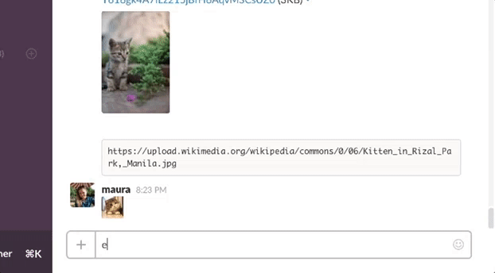

# ML Slack -- A Slackbot that Emojifies

Wish you could type a command into Slack that just automatically adds 
an emoji? Yep, this does that. 

It's as simple as writing a message: 
<code>emojify :maru: http://assets.rbl.ms/4143308/980x.jpg</code>

If you haven't found an image URL yet, you can search images by typing 
the "emojify" command followed by your search terms.

## Setup

You'll need a secure (https) WordPress install running > 4.4, and after installing and activating the plugin visit Settings -> ML Slack Admin. 

It should be noted this does not work with Slack Teams that have Two-factor Authentication enabled. This plugin will be a beta/unstable product until Slack decides to add a true API endpoint for uploading emoji. ¯\_(ツ)_/¯

Below are instructions for getting the information you need from both Slack and Google. Take note of any keys noted so you can enter them into the _ML Slack Admin_ page in WordPress!

### Setting Up in Slack

I recommend you create a user in your Slack install that's only meant for your WPAPI to use. Once you create the user, make sure it has the appropriate priveleges to be able to upload emoji, and note the username and password as you'll need to enter it into the WordPress _ML Slack Admin_ screen. 

_*Note, I know (and you should know) saving those credentials in WordPress is a bad idea. This plugin is just a fun exercise and a means to an end until Slack gives us an emoji upload endpoint in their API. Use this at your own risk._

After creating your user, it's time to create your Slackbot! Head over to the Custom Integrations page in your team's Slack admin (https://myteam.slack.com/apps/manage/custom-integrations), select "Outgoing Webhooks", and then "Add Configuration".

1. Select a channel that you want to enable this Slackbot on. I went with any but you could limit it if you want. 
2. Add the trigger word `emojify` -- that's all this plugin supports at the moment.
3. Add the URL to your WordPress installation where you've installed the **ML Slack** plugin with the mojibot endpoint! The URL will look like `https://mysite.com/wp-json/ml/v1/mojibot`.
4. The token listed on this page will go into the _Slack Mojibot Token_ field in the ML Slack Admin screen in your WordPress admin.
5. Add a descriptive label, name, and icon to go with your slackbot. I recommend naming it `mojibot`.
6. Finally, be sure to save the settings!

### Getting Google Keys

This is an optional feature for running a google image search query right in Slack. You'll need both a Google API key for search requests and a custom search engine "cx" token. 

1. Create a custom search engine at https://cse.google.com/cse/all
You'll need the "cx" key from this. I didn't set anything custom, I want to search :allthethings:! Basically, it'll already search the entire web... though you could add a few domains to specifically search if you'd like. 

2. **Ensure "Image search" is set to ON**

3. Click "Get code" because that'll have the cx key in a var in the javascript snippet. 

   Mine looked like: 
   <code>
    <gcse:search></gcse:search>
    </code>
    
4. Visit https://console.developers.google.com/apis/library -- you need "Custom Search API" and from the library, now you need to "Create a project". I named mine Mojibot.

5. Upon creation, from the Dashboard section of the "Mojibot" project in the console, click "Enable API" at the top.

6. Find "Custom Search API" in the library, click it, and then click "Enable" at the top of that screen too. 

7. Click "Credentials" and you should see a "Create credentials", select "API Key" from the dropdown, and then I selected "Server key" -- I named the key "Tealio Mojibot" since that's where this is getting used.
